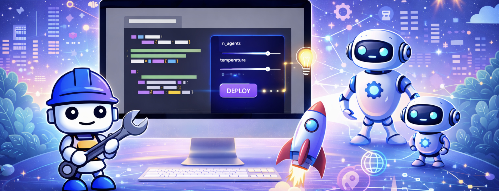
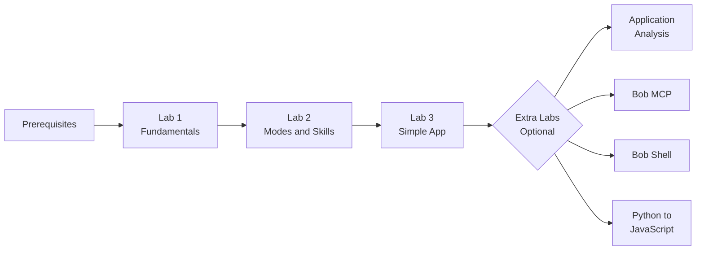

# IBM Bob Overview and Hands-on Experience

A hands-on workshop introducing [IBM Bob](https://bob.ibm.com) — IBM's AI-powered developer assistant. You'll learn how to navigate Bob, customize it for your team's workflows, and use it to build real software from scratch.

---

## Hands-on Lab Structure

The labs is organized into two sections:

- **Core Labs** (`labs/`) — Three sequential labs that build on each other. Complete them in order.
- **Extra Labs** (`extra-labs/`) — Four standalone labs covering specialized topics. Start these any time after completing the core labs.

---

### 🎓 Core Labs

| # | Lab | Duration | What You'll Do |
|---|-----|----------|----------------|
| 1 | [Bob Fundamentals](labs/README.md#1-bob-fundamentals) | ~20 min | Learn Bob's interface, modes, and approval workflow |
| 2 | [Modes & Skills](labs/README.md#2-modes--skills) | ~15 min | Create custom modes, skills, and slash commands |
| 3 | [Building a Simple Application](labs/README.md#3-building-a-simple-application) | ~40 min | Build a full-stack todo app using Bob's Plan, Code, Advanced and Ask modes |

➡️ **[View full lab details and prerequisites →](labs/README.md)**

---

### 🚀 Extra Labs

These labs are independent and can be completed in any order after finishing the core labs.

| Lab | Duration | What You'll Do |
|-----|----------|----------------|
| [Application Analysis](extra-labs/application-analysis/) | 45–60 min | Analyze a codebase with Bob — generate architecture diagrams, find security issues, apply fixes |
| [Bob MCP](extra-labs/bob-mcp/) | ~15 min | Understand the Model Context Protocol and how Bob uses MCP tools |
| [Bob Shell](extra-labs/bob-shell/) | ~15 min | Use Bob from the command line for interactive workflows and automation |
| [Python to JavaScript](extra-labs/python-to-javascript/) | ~15 min | Translate a Python data processing script to JavaScript with Bob |

---

## Support & Resources

- **Lab-specific questions:** Check the troubleshooting section in each lab
- **Bob documentation:** [bob.ibm.com/docs](https://bob.ibm.com/docs)
- **Bob IDE docs:** [bob.ibm.com/docs/ide](https://bob.ibm.com/docs/ide)
